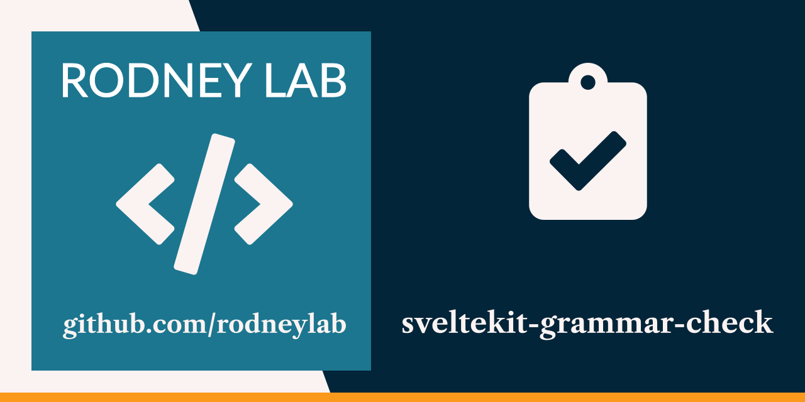

<p align="center">
  <a aria-label="Open Rodney Lab site" href="https://rodneylab.com" rel="nofollow noopener noreferrer">
    
  </a>
</p>
<h1 align="center">
  SvelteKit Grammar Check
</h1>

# sveltekit-grammar-check

[](https://stackblitz.com/github/rodneylab/sveltekit-grammar-check)

Demo code for running proofreading checks with LanguageTool in SvelteKit. The code accompanies the <a href="https://rodneylab.com/sveltekit-grammar-check/">post on using forms with SvelteKit</a>. If you have any questions, please drop a comment at the bottom of that page.

## Building and previewing the site

If you're seeing this, you've probably already done this step. Congrats!

```bash
git clone https://github.com/rodneylab/sveltekit-grammar-check.git
cd sveltekit-grammar-check
pnpm install # or npm install
pnpm dev
```

## Building

```bash
pnpm run build
```

> You can preview the built app with `pnpm preview`, regardless of whether you installed an adapter. This should _not_ be used to serve your app in production.

Feel free to jump into the [Rodney Lab matrix chat room](https://matrix.to/#/%23rodney:matrix.org).
